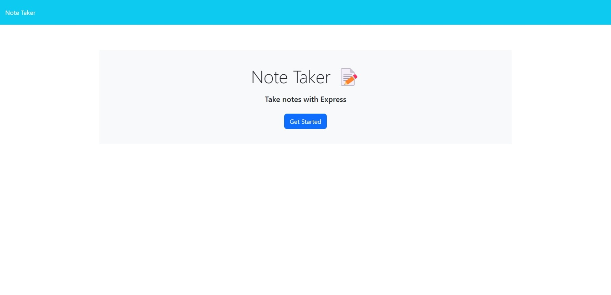
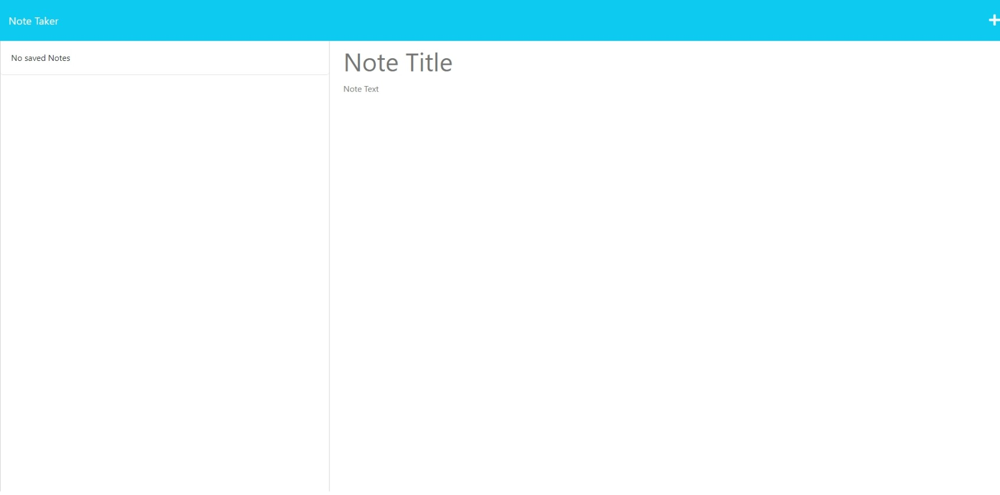

# Note Taker App

## Description

The Note Taker App is a simple web application that allows users to create, save, and delete notes. It provides an easy way to jot down quick thoughts and reminders on the go.

## Table of Contents

- [Note Taker App](#note-taker-app)
  - [Description](#description)
  - [Table of Contents](#table-of-contents)
  - [Installation](#installation)
  - [Usage](#usage)
  - [Features](#features)
  - [Screenshots](#screenshots)
  - [Deployed App](#deployed-app)
  - [Technologies Used](#technologies-used)
  - [Contributing](#contributing)
  - [License](#license)
  - [Contact](#contact)

## Installation

1. Clone the repository: `git clone https://github.com/yourusername/note-taker.git`
2. Navigate to the project directory: `cd note-taker`
3. Install dependencies: `npm install`

## Usage

1. Start the application: `npm start` or `node server.js`
2. Open your web browser and navigate to: `http://localhost:3001`

## Features

- Create new notes with a title and content.
- Save notes to a list for future reference.
- Delete notes when they are no longer needed.

## Screenshots

*Screenshot of Homepage*

*Screenshot of NoteTaker*

## Deployed App

You can access the deployed app on Heroku: [My Awesome Note Taker App](https://your-heroku-app-name.herokuapp.com/)

## Technologies Used

- HTML
- CSS
- JavaScript
- Node.js
- Express.js
- uuid (for generating unique IDs)

## Contributing

Contributions are welcome! If you find any issues or have suggestions for improvements, please open an issue or submit a pull request.

## License

This project is licensed under the [MIT License](LICENSE).

## Contact
If you have any questions, feedback, or inquiries, feel free to contact the developer:

Email: vinoshan@outlook.com 
GitHub: github.com/vinoshan 
LinkedIn: https://www.linkedin.com/in/vinoshank/